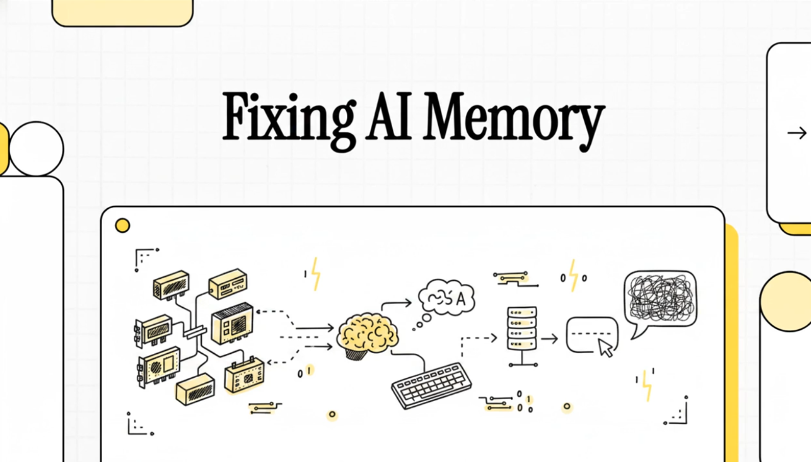

# 2.7 Optimized Inference Deployment

[📖 Chapter link](https://huggingface.co/learn/llm-course/en/chapter2/8)

## 🗒 Section Notes

*( I used Google's **NotebookLM** for the first time to create the notes for this chapter. 📝   I also generated an AI-powered info-graphics video to help visualize these concepts. 
You can check it out here:   
🎥 [Video](./Optimized_Inference_Deployment.mp4)    
    Enjoy the deep dive! 🚀 )* 

# Optimized Inference Deployment for LLMs

This repository explores modern frameworks and techniques for deploying Large Language Models (LLMs) with high efficiency. Serving LLMs in production requires addressing critical memory and throughput bottlenecks using specialized engines like **Text Generation Inference (TGI)**, **vLLM**, and **llama.cpp**.

---

## 🧠 Conceptual Background: The Bottleneck
To understand optimized inference, one must recognize that LLM performance is typically **memory-bound**, not compute-bound.

### 1. SRAM vs. HBM: The Speed Gap
The GPU hardware architecture consists of two primary memory types:
*   **High Bandwidth Memory (HBM):** The "main warehouse" where model weights and the KV cache are stored. It is large but slower to access.
*   **Static Random-Access Memory (SRAM):** The "immediate desktop" located on the GPU chip. It is ultra-fast but extremely small (measured in MBs).

**The Problem:** Standard attention mechanisms repeatedly move data back and forth between HBM and SRAM. This constant transfer leaves the GPU idle while it waits for data, creating a **Memory Bandwidth Bottleneck**.

### 2. The KV Cache Challenge

> 
The **KV (Key-Value) cache** is a memory management technique used during LLM inference to speed up text generation by storing and reusing intermediate results instead of recomputing them.
> 
> 
> 
> ### **Why it is necessary**
> 
> Large Language Models generate text **autoregressively**, meaning they predict one token at a time. To predict the next token, the model needs to "attend" to every single previous token in the sequence. Without a KV cache, the model would have to re-process every preceding word in the sentence every time it generates a new one, which is extremely inefficient and slow.
> 
> 
> 
> ### **How it works**
> 
> In the Transformer architecture, each token has "Key" (K) and "Value" (V) vectors used in the attention mechanism. Once these vectors are calculated for a token, they do not change as the sequence grows. The **KV cache** saves these vectors in the GPU's memory (High Bandwidth Memory or HBM) so the model can simply look them up for future tokens instead of recalculating them.
> 
> 
> 
> ---
> 
> 
> 
> ### **Step-by-Step Example**
> 
> 
> 
> Imagine you ask an LLM: **"The capital of France is"**
> 
> 
> 
> 1.  **Prefill Phase:** The model processes the initial prompt. It calculates the K and V vectors for "The", "capital", "of", "France", "is". These are all stored in the **KV cache**.
> 
> 2.  **Generation Step 1:** Using the prompt, the model predicts the next token: **"Paris"**.
> 
>     *   The K and V vectors for "Paris" are calculated and added to the **KV cache**.
> 
> 3.  **Generation Step 2:** The model now needs to predict the next token (likely a period ".").
> 
>     *   **Without KV Cache:** The model would have to re-read and re-calculate "The capital of France is Paris" from scratch.
> 
>     *   **With KV Cache:** The model simply pulls the saved vectors for "The capital of France is" from memory and only calculates the vectors for the new token "Paris".
> 
> 
> 
> ---
> 
> 
> 
> ### **The Memory Challenge**
> 
> While the KV cache saves time, it creates a significant memory bottleneck:
> 
> *   **Dynamic Growth:** The cache grows with every token generated, making its size unpredictable.
> 
> *   **Large Footprint:** For long sequences or many simultaneous users, the KV cache can become **enormous**, often exceeding the size of the model's actual weights.
> 
> *   **Fragmentation:** Traditional systems reserve a large, continuous block of memory for the KV cache. If a request is shorter than expected, that reserved memory is wasted (internal fragmentation).
> 
> 
> 
> To solve these issues, frameworks like **vLLM** use **PagedAttention**, which treats the KV cache like virtual memory in an operating system, dividing it into small "pages" that can be stored anywhere in memory to eliminate waste.

LLMs generate text **autoregressively**—predicting one token at a time based on all previous tokens.
*   **Purpose:** To avoid redundant math, the model stores previous attention results (Keys and Values) in a **KV cache**.
*   **The Issue:** The KV cache is massive and grows dynamically with every generated token. Traditional systems reserve large, continuous blocks of memory for this cache, leading to **fragmentation** (wasted "holes" in memory) and preventing large batch sizes.

---

## 🛠️ The Three Core Methods

### **Text Generation Inference (TGI)**
A production-ready toolkit developed by Hugging Face for serving the most popular open-source LLMs.
*   **Key Innovation—Flash Attention:** TGI utilizes **Flash Attention 2**, which loads data into SRAM once and performs calculations there, drastically reducing HBM/SRAM memory transfers.
*   **Enterprise-Grade:** Built for stable, predictable deployments with native support for Kubernetes, Prometheus monitoring, and distributed tracing.
*   **Best For:** Production environments requiring high stability and deep integration with the Hugging Face ecosystem.

### **vLLM**
A high-throughput library originally developed at UC Berkeley, designed for maximum efficiency.
*   **Key Innovation—PagedAttention:** Inspired by virtual memory in operating systems, it divides the KV cache into small, fixed-size "**pages**".
*   **Near-Zero Waste:** Pages do not need to be contiguous in memory, allowing for flexible allocation and **memory sharing** (e.g., sharing the prompt KV cache across multiple outputs).
*   **Performance:** Achieves up to **24x higher throughput** than traditional serving methods.
*   **Best For:** Applications requiring high concurrency and raw serving speed.

### **llama.cpp**
A highly optimized C/C++ implementation focused on making LLMs accessible on consumer hardware.
*   **Key Innovation—Quantization:** Reduces model weight precision (from 16-bit to 8-bit, 4-bit, or even 2-bit), drastically shrinking the model’s memory footprint.
*   **Hardware Portability:** Designed to run efficiently on CPUs (using AVX or NEON) and Apple Silicon while offering optional GPU acceleration.
*   **Best For:** Local deployment, edge devices, and resource-constrained environments where installing Python frameworks is difficult.

---

## 📊 Framework Comparison

| Feature | **TGI** | **vLLM** | **llama.cpp** |
| :--- | :--- | :--- | :--- |
| **Primary Goal** | Production Stability | Maximum Throughput | Hardware Portability |
| **Core Strategy** | Flash Attention 2 | PagedAttention | Quantization |
| **Deployment** | Docker / Kubernetes | Python-native / Ray | Lightweight C++ |
| **Ideal Hardware** | GPU Clusters | High-end GPUs | Laptops & CPUs |

---

## ⚙️ Advanced Generation Control and Memory Management

Modern frameworks provide granular control over how text is generated and how hardware resources are utilized.

### 1. Token Selection and Sampling
To influence the "creativity" and accuracy of the model, you can adjust:
*   **Temperature:** Controls randomness; higher values increase variety, while lower values make output more deterministic.
*   **Top-p (Nucleus) Sampling:** Limits the selection to a subset of tokens whose cumulative probability reaches threshold X%.
*   **Top-k Filtering:** Only considers the top $k$ most likely tokens for the next step.

### 2. Controlling Repetition
Frameworks implement **Repetition Penalties** to prevent the model from getting stuck in loops or repeating identical phrases.

### 3. Length Control and Stop Sequences
*   **Max New Tokens:** Strictly limits how many tokens the model can generate.
*   **Stop Sequences:** Allows users to define specific strings (like `\n` or `User:`) that will immediately trigger the end of generation.

### 4. Specialized Memory Management
*   **Continuous Batching:** Used by TGI and vLLM to feed the GPU work constantly, ensuring no idle time between user requests.
*   **CPU Offloading:** llama.cpp can move parts of a model to system RAM if it is too large to fit in the GPU's VRAM.
*   **Tensor Parallelism:** TGI and vLLM can split a single model across multiple GPUs to handle massive models that exceed one card's capacity.
*   **Speculative Decoding:** Uses a smaller "draft" model to predict tokens, which are then validated by the larger model, often doubling generation speed.