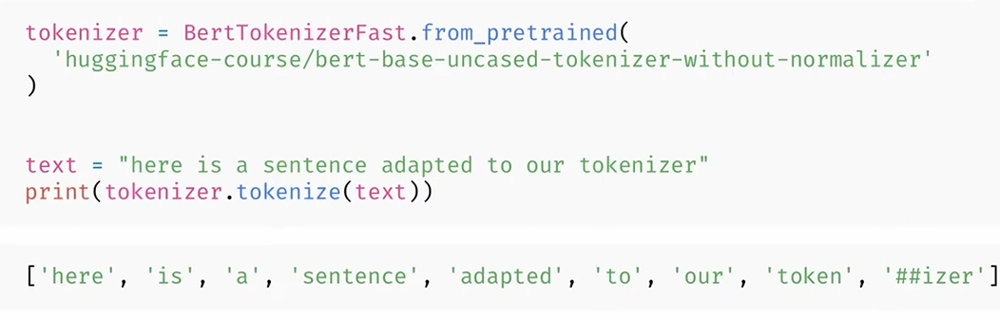
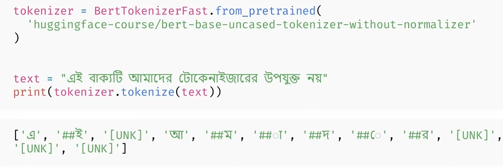
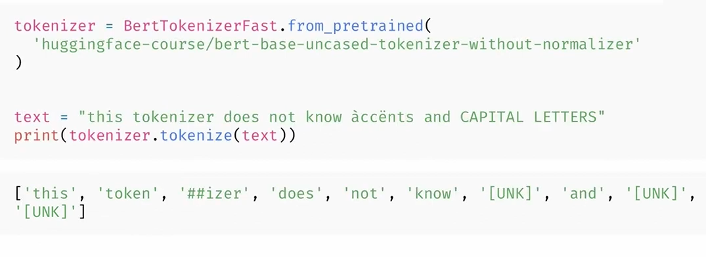
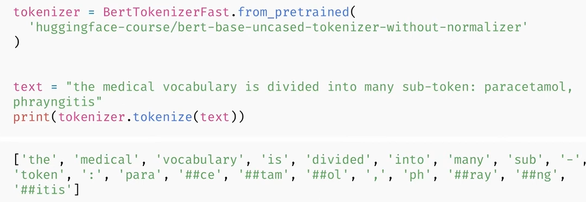

# 6.2 Training a new tokenizer from an old one

[📖 Chapter link](https://huggingface.co/learn/llm-course/chapter6/2)

▶ Video links:

1. [Training a new tokenizer](https://youtu.be/DJimQynXZsQ)

## 🗒 Section Notes

_(The screenshots attached below are taken from the video [Training a new tokenizer](https://youtu.be/DJimQynXZsQ) mentioned above)_

### When Should You Train a New Tokenizer?

A trained tokenizer may not be suitable for our corpus if our corpus:

- Is written in a different language.
- Uses new characters, such as accents or uppercase letters.
- Has a specific vocabulary, such as medical or legal terminology.
- Uses a different style, such as language from another century.

For example, consider the tokenizer trained for the bert-base-uncased model.

If we ignore its normalization step and use it on the English sentence:

"here is a sentence adapted to our tokenizer"

The tokenization is relatively satisfactory. The sentence contains 8 words and is tokenized into 9 tokens.

However, if we use the same tokenizer on a sentence in Bengali, we may see two problems:
1. A word may be divided into many subtokens (as happened with 'আমাদের' in the example below)
2. The tokenizer may not recognize one of the Unicode characters and return only an `unknown` token.

A common word being split into many tokens can be problematic because language models can only handle a sequence of tokens of limited length.

Therefore:
1. Excessive tokenization can make the input sequence unnecessarily long.
2. It may even impact the performance of the model.

Unknown tokens are also problematic because the model cannot extract any information from the part of the text represented by the unknown token.

For example, the tokenizer may replace words containing accented characters, capital letters with unknown tokens.

The same issue occurs with specialized or domain-specific vocabulary.

For example, when using the tokenizer on medical vocabulary, a single word can be divided into many subtokens.

Examples:

paracetamol → 4 subtokens
pharyngitis → 4 subtokens

This indicates that the tokenizer was not well adapted to this particular vocabulary.

### Key Steps for Training a New Tokenizer

**Step 1:** Build a Training Corpus

First, we need to build a training corpus composed of raw texts. The corpus should be representative of the type of data that our model will work with. For example, if we want to train a model for Python code, our tokenizer training corpus should contain a substantial amount of Python code.

**Step 2:** Choose a Tokenizer Architecture

Next, we need to choose an architecture for our tokenizer. There are two options:

1. Reuse an existing architecture - The simplest option. Reuse the same architecture as a tokenizer used by another already-trained model.
2. Design our own tokenizer - We can completely design a new tokenizer.However, this requires more experience and attention.

**Step 3:** Train the Tokenizer

Once the architecture has been selected, train the tokenizer on the corpus we created.

**Step 4:** Save the Learned Rules

After training is complete, save the learned tokenizer rules. This allows us to reuse the newly trained tokenizer later.

⚠️ Training a tokenizer is not the same as training a model! Model training uses stochastic gradient descent to make the loss a little bit smaller for each batch. It's randomized by nature (meaning yweou have to set some seeds to get the same results when doing the same training twice). Training a tokenizer is a statistical process that tries to identify which subwords are the best to pick for a given corpus, and the exact rules used to pick them depend on the tokenization algorithm. It's deterministic, meaning we always get the same results when training with the same algorithm on the same corpus.

