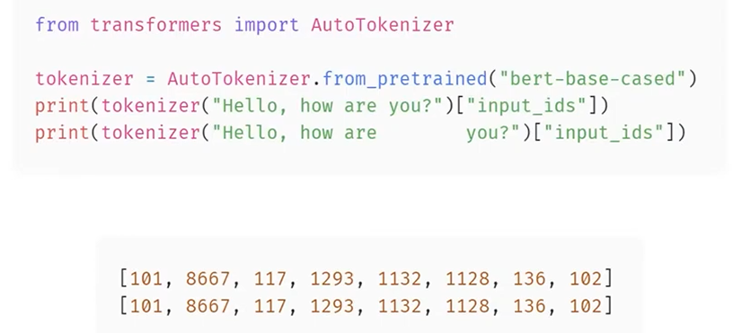
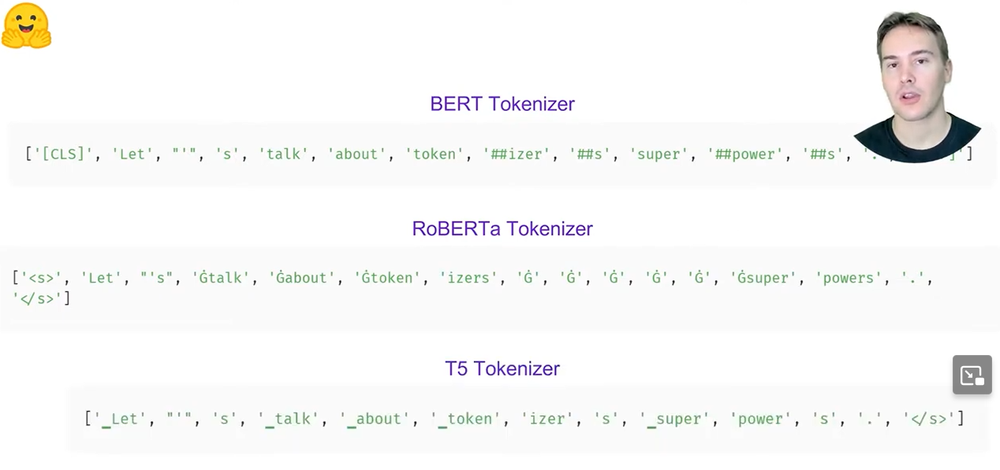
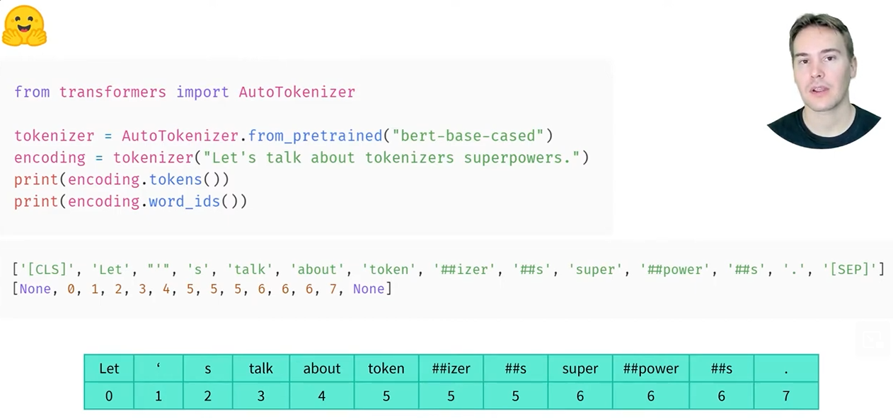
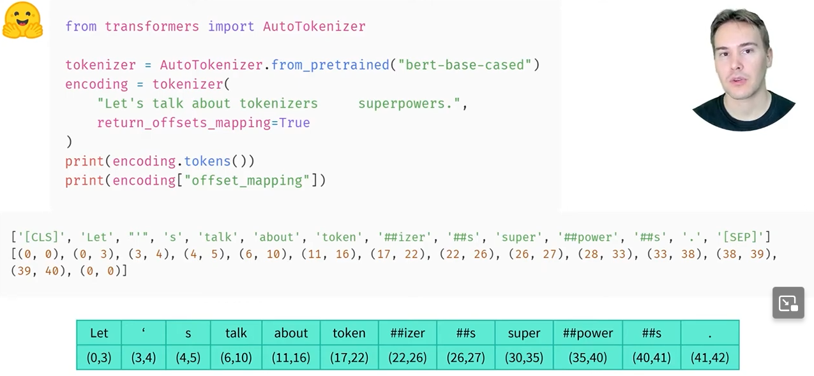
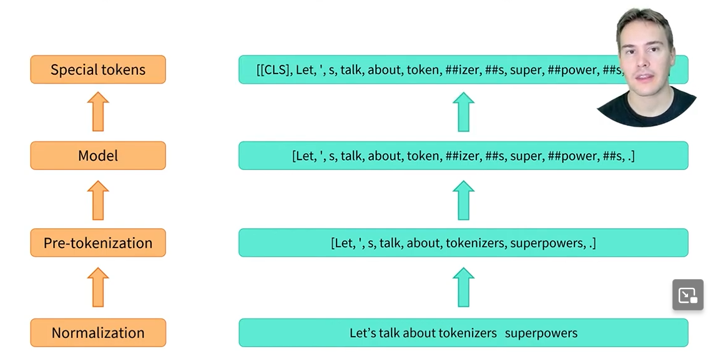
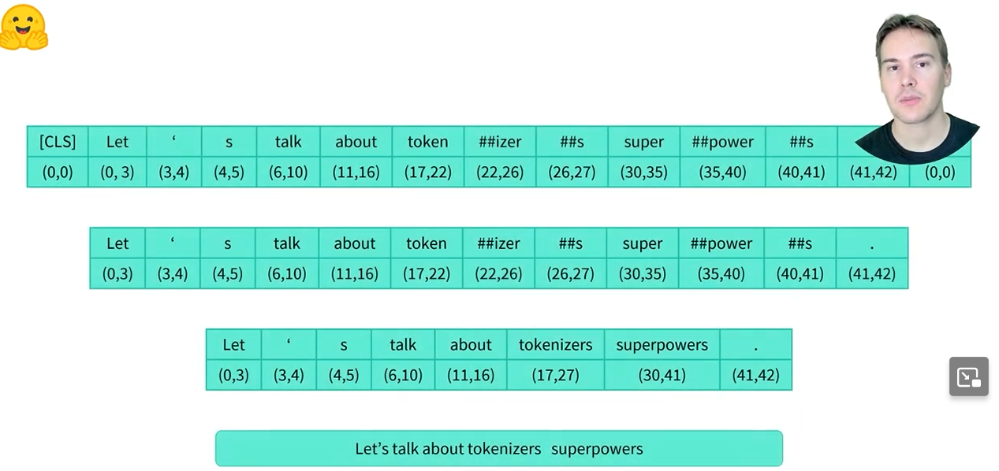
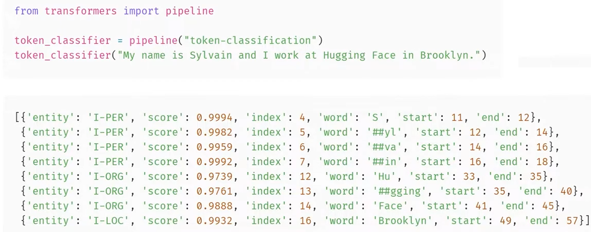
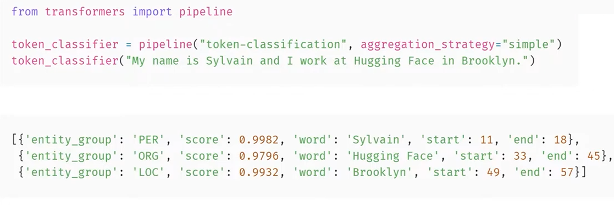
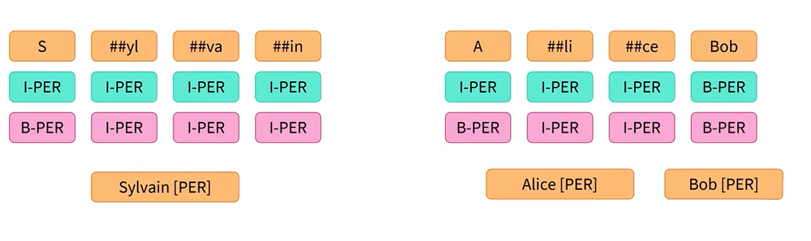

# 6.3 Fast tokenizers' special powers

[📖 Chapter link](https://huggingface.co/learn/llm-course/chapter6/3)

▶ Video links:

1. [Why are fast tokeizers called fast?](https://youtu.be/g8quOxoqhHQ)
2. [Fast tokenizer superpowers](https://youtu.be/3umI3tm27Vw)
3. [Inside the token classification pipeline (using PyTorch)](https://youtu.be/0E7ltQB7fM8)

## 🗒 Section Notes

_(The screenshots attached below are taken from the videos [Fast tokenizer superpowers](https://youtu.be/3umI3tm27Vw) and [Inside the token classification pipeline](https://youtu.be/0E7ltQB7fM8) mentioned above)_

Slow tokenizers are those written in Python inside the 🤗 Transformers library, while the fast versions are the ones provided by 🤗 Tokenizers, which are written in Rust. If you remember the table from [Chapter 5.3](../../Chapter5%20-%20%20The%20HuggingFace%20Datasets%20library/5.3%20Time%20to%20slice%20and%20dice/Time_to_slice_and_dice.ipynb) that reported how long it took a fast and a slow tokenizer to tokenize the Drug Review Dataset, you should have an idea of why we call them fast and slow:

Options         | Fast tokenizer | Slow tokenizer
:--------------:|:--------------:|:-------------:
`batched=True`  | 29.7s          | 5min16s
`batched=False` | 2min16s        | 6min18s

⚠️ **WARNING:** When tokenizing a single sentence, you won't always see a difference in speed between the slow and fast versions of the same tokenizer. In fact, the fast version might actually be slower! It's only when tokenizing lots of texts in parallel at the same time that you will be able to clearly see the difference.

### Other benefits of Fast Tokenizers

Besides their parallelization capabilities, the key functionality of fast tokenizers is that they always keep track of the original span of texts the final tokens come from — a feature called **offset mapping**.



For instance, here 👆 the tokenization is the same for the two sentences, even if one has several more spaces than the other.<br>
Just having the input IDs is thus not enough if we want to match some tokens with a span of text (something we will need to do when tackling question answering for instance).



It's also difficult to know when two tokens belong to the same word or not: it looks easy when you just look at the output of a BERT tokenizer, we just need to look for the ##. But other tokenizers have different ways to tokenize parts of words.For instance, RoBERTa adds this special G symbol to mark the tokens at the beginning of a word,and T5 uses this special underscore symbol for the same purpose.<br>
Thankfully, the fast tokenizers keep track of the word each token comes from, with a word_ids method you can use on their outputs.



The output is not necessarily clear, but assembled together in a nice table like this, we can look at the word position for each token.



Even better, the fast tokenizers keep track of the span of characters each token comes from, and we can get them when calling it on one (or several) text by adding the `return_offsets_mapping=True` argument.<br>
In this instance, we can see how we jump positions between the ##s token and the super token, because of the multiple spaces in the initial sentence. To enable this, the fast tokenizers store additional information at each step of their internal pipeline.



That internal pipeline consists of normalization, where we apply some cleaning to the text, like 
1. lowercasing or removing the accents
2. pre-tokenization, which is where we split the texts into words
3. applying the model of the tokenizer, which is where the words are splits into tokens
4. doing the post-processing, where special tokens are added.



From the beginning to the end of the pipeline, the tokenizer keeps track of each span of text that corresponds to each word, then each token.

We will see how useful it is when we tackle the following tasks: 
1. When doing **masked language modeling**, one variation that gets state-of-the-art results is to mask all the tokens of a given word instead of randomly chosen tokens. This will require us to use the word IDs we saw.

2. When doing **token classification**, we'll need to convert the labels we have on words, to labels on each tokens.

3. As for the offset mappings, it will be super useful when we need to convert token positions in a sentence into a span of text, which we will need to know when looking at **question answering** or when grouping the tokens corresponding to the same entity in **token classification**.

We have some examples of this in the [notebook](./Fast_tokenizers'_special_powers_(PyTorch).ipynb) also.

---
### Token Classification Pipeline


#### 1. What is Token Classification?

Token classification assigns a **label to every token** in a sentence.

Example:

| Token | My | name | is | Sylvain | and | I | work | at | Hugging | Face | in | Paris |
|---|---|---|---|---|---|---|---|---|---|---|---|---|
| Label | O | O | O | B-PER | O | O | O | O | B-ORG | I-ORG | O | B-LOC |

**Labels:**

- `O` → No entity
- `B-PER` → Beginning of a Person entity
- `I-PER` → Inside/continuation of a Person entity
- `B-ORG` → Beginning of an Organization entity
- `I-ORG` → Inside/continuation of an Organization entity
- `B-LOC` → Beginning of a Location entity
- `I-LOC` → Inside/continuation of a Location entity



It can also group together tokens corresponding to the same entity.



Here:

PER → Person<br>
ORG → Organization<br>
LOC → Location<br>
O → No entity

#### 2. Sequence vs Token Classification

**Sequence Classification** → One prediction for the **whole sentence**.

**Token Classification** → One prediction for **each token**.


#### 3. Token Classification Pipeline

The pipeline has **3 main steps**:

```text
Text
 ↓
Tokenization
 ↓
Token Classification Model
 ↓
Post-processing
 ↓
Final Entities
```

For token classification, we use `AutoModelForTokenClassification` instead of `AutoModelForSequenceClassification`

#### 4. Tokenization

The tokenizer converts text into tokens that the model understands.

Example:

```text
"My name is Sylvain"
        ↓
["My", "name", "is", "Sylvain"]
```

A word can also be split into **subword tokens**.

Example:

```text
"HuggingFace"
      ↓
["Hugging", "##Face"]
```

The tokenizer can also provide **offset mapping**.

Offset mapping tells us where each token occurs in the original text.

It is used to find the **start and end character positions** of entities.


#### 5. Model

A token classification model produces predictions for **every token**.

Example:

```text
19 tokens × 9 possible labels
```

The model therefore produces logits for every:

**token × label combination**


#### 6. Logits → Probabilities

The model initially outputs **logits** (raw scores).

Example for `Paris`:

```text
O       → 0.2
B-PER   → 0.1
B-LOC   → 3.8
B-ORG   → 0.4
```

Apply **SoftMax**:

```text
O       → 0.02
B-PER   → 0.01
B-LOC   → 0.93
B-ORG   → 0.04
```

Highest probability:

`B-LOC → 0.93`

Therefore:

**Paris → B-LOC**

> SoftMax preserves the ordering of logits, so `argmax` can
> be applied directly to logits when probabilities are not needed.


#### 7. `id2label`

The model configuration contains an `id2label` mapping.

It converts numerical label IDs into readable labels.

Example:

```python
{
    0: "O",
    1: "B-PER",
    2: "I-PER",
    3: "B-ORG",
    4: "I-ORG",
    5: "B-LOC",
    6: "I-LOC"
}
```

If the model predicts:

```text
5
```

`id2label` converts it to:

```text
B-LOC
```

---

#### 8. The `O` Label

`O` means **No entity / Outside an entity**.

Example:

```text
I       → O
live    → O
in      → O
Paris   → B-LOC
```

Tokens labelled `O` are normally ignored when extracting entities.


#### 9. Offset Mapping

Offset mapping gives the **character positions** of tokens
in the original sentence.

Example:

```text
"John lives in Paris."

John   → characters 0–4
Paris  → characters 14–19
```

If:

```text
Paris → B-LOC
```

the pipeline can return:

```text
Entity → Paris
Start  → 14
End    → 19
```


#### 10. B- and I- Labels

`B` = **Beginning**

`I` = **Inside / continuation**

Example:

```text
Elon  → B-PER
Musk  → I-PER
```

These tokens are grouped together:

```text
Elon + Musk
    ↓
Elon Musk → PER
```

Another example:

```text
Hugging → B-ORG
Face    → I-ORG
```

Result:

```text
Hugging Face → ORG
```


#### 11. Why Do We Need `B-`?

`B-` identifies the **start of a new entity**.

Example:

```text
John  → B-PER
Smith → I-PER
Mary  → B-PER
Jones → I-PER
```

This represents two separate entities:

```text
John Smith → PER
Mary Jones → PER
```

It is worth noting that there are two ways of labelling used for token classification, one (in pink below👇) uses the B-PER label at the  beginning of each new entity, but the other (in blue) only uses it to separate two adjacent  entities of the same type. In both cases, we can flag a new entity each time we see a new label appearing (either with the I or B prefix) then take all the following tokens labelled the same, with an I-flag. 



#### 12. Post-processing

After predicting labels, the pipeline combines:

- Token
- Label
- Score/probability
- Start character
- End character

It then groups related `B-` and `I-` tokens into complete entities.


#### Complete Example

Sentence:

```text
"Barack Obama visited Microsoft in Seattle."
```

Predictions:

```text
Barack     → B-PER
Obama      → I-PER
visited    → O
Microsoft  → B-ORG
in         → O
Seattle    → B-LOC
```

After grouping:

```text
Barack Obama → PER
Microsoft    → ORG
Seattle      → LOC
```
