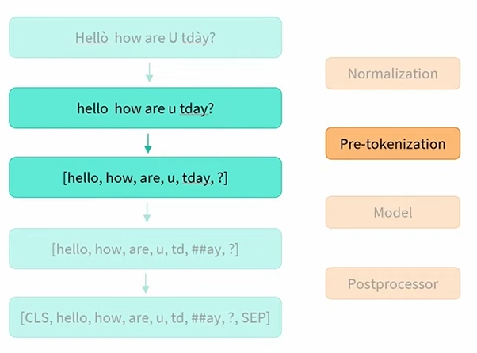
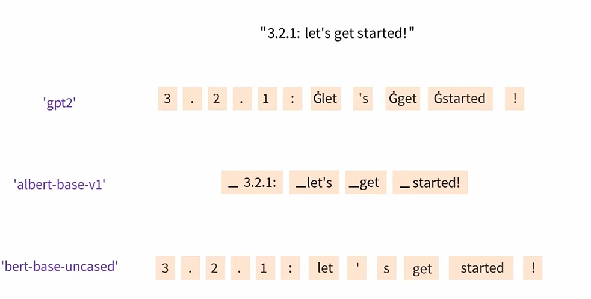

# 6.4  Normalization and pre-tokenization

[📖 Chapter link](https://huggingface.co/learn/llm-course/chapter6/4)

▶ Video links:
1. [What is normalization?](https://youtu.be/4IIC2jI9CaU)
2. [What is pre-tokenization?](https://youtu.be/grlLV8AIXug)

## 🗒 Section Notes
Before splitting a text into subtokens (according to its model), the tokenizer performs two steps: **normalization** and **pre-tokenization**.

### Normalization
Normalization is done to remove noise from the text which is useless for learningand use of the language models.

To see how various tokenizers' normalization produce different normalized text from the same input text, check the [video 1](https://youtu.be/4IIC2jI9CaU) above.

We must be aware that some normalizations can be very harmful if they are not adapted to their corpus. 
For example, if you take the French sentence "un père indigné", which means "An **indignant** father", and normalize it with the bert-base-uncase tokenizer which removes the accents then the sentence becomes "un père indigne" which means "An **unworthy** father".

### Pre-tokenization
The pre-tokenization operation is the operation performed after the normalization of the text and before the application of the tokenization algorithm. 

This step consists in applying rules that do not need to be learned to perform a first division of the text.

Let's look at how several tokenizers pre_tokenize this example:

## Overview of next three chapters

In the following sections, we'll dive into the three main subword tokenization algorithms: BPE (used by GPT-2 and others), WordPiece (used for example by BERT), and Unigram (used by T5 and others). Before we get started, here's a quick overview of how they each work. Don't hesitate to come back to this table after reading each of the next sections if it doesn't make sense to you yet.

Model | BPE | WordPiece | Unigram
:----:|:---:|:---------:|:------:
Training | Starts from a small vocabulary and learns rules to merge tokens |  Starts from a small vocabulary and learns rules to merge tokens | Starts from a large vocabulary and learns rules to remove tokens
Training step | Merges the tokens corresponding to the most common pair | Merges the tokens corresponding to the pair with the best score based on the frequency of the pair, privileging pairs where each individual token is less frequent | Removes all the tokens in the vocabulary that will minimize the loss computed on the whole corpus
Learns | Merge rules and a vocabulary | Just a vocabulary | A vocabulary with a score for each token
Encoding | Splits a word into characters and applies the merges learned during training | Finds the longest subword starting from the beginning that is in the vocabulary, then does the same for the rest of the word | Finds the most likely split into tokens, using the scores learned during training
